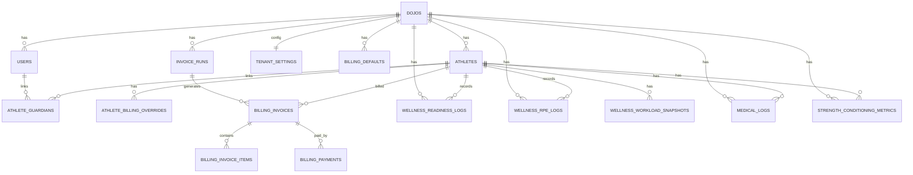

# Athlix Master System Architecture (MySQL + VPS First)

## 1) Recommended Tech Stack

### Frontend
- `Inertia.js + React + Vite` (existing stack, keep for fast delivery)
- `TailwindCSS` for design system
- `PWA`: Service Worker + IndexedDB (`idb`) for offline attendance/readiness queue
- Charts: `recharts` (radar/line/bar)
- QR: `html5-qrcode` (already used)
- Push (native-ready): Web Notifications now, upgrade path to FCM Web Push

### Backend
- `Laravel 12` (monolith modular)
- `Laravel Sanctum` for API auth (PWA/mobile/web token + SPA cookie)
- Queue/Jobs: `database` driver on VPS now, Redis-ready later
- Scheduler: Laravel scheduler + VPS cron for recurring invoice run
- File storage: local/public disk now, S3-compatible abstraction ready via tenant settings

### Database
- `MySQL 8.x`
- Multi-tenant row-level isolation via `tenant_id` (`dojo_id`) and query scoping
- Core design: strict FK + composite index for tenant filtering

### State Management
- Web admin: Inertia page props + local React state
- PWA: local IndexedDB queue for offline-first sync
- API sync status fields (`pending/synced/failed`) on readiness/RPE logs

## 2) ERD Focus (Multi-Tenant Core, RBAC, Dynamic Billing)

## 3) API Routing Structure (Athlete Wellness Module)

Base: `/api/v1` (`auth:sanctum`)

### Wellness
- `GET /wellness/dashboard`
- `GET /wellness/readiness`
- `GET /wellness/readiness/latest`
- `POST /wellness/readiness`
- `GET /wellness/rpe-logs`
- `POST /wellness/rpe-logs`
- `GET /wellness/workload/latest`

### Notifications (native push prep)
- `GET /notifications/devices`
- `POST /notifications/devices`
- `DELETE /notifications/devices/{device}`

### Dynamic Billing (admin/ops)
- `GET /billing/dynamic/defaults`
- `POST /billing/dynamic/defaults`
- `POST /billing/dynamic/overrides`
- `POST /billing/dynamic/generate`
- `GET /billing/dynamic/invoices`

## VPS-First Deployment and Migration Path

- Current: single VPS (`nginx + php-fpm + mysql + queue worker + cron`)
- Keep environment abstraction:
  - Storage via `tenant_settings.media_disk` (switch `public` -> `s3` later)
  - Queue via `tenant_settings.queue_driver` (switch `database` -> `redis` later)
- Docker migration later:
  - Split app, queue, scheduler, mysql, redis containers
  - No schema refactor required (tenant model already row-based)
